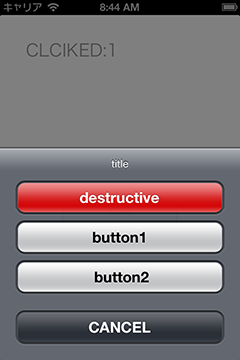

UIActivityANE
=============

UIACtionSheet Native Extension for Adobe AIR

This Native Extension require iOS6+ and Adobe AIR 3.5+!!

##Usage
	import net.nodera.ane.ActionSheetANE;
	import net.nodera.ane.event.ActionSheetEvent;
	import flash.events.MouseEvent;
	import flash.events.Event;

	actionBtn.addEventListener(MouseEvent.CLICK, function(e:MouseEvent):void {
		var actionSheet:ActionSheetANE = new ActionSheetANE();
		actionSheet.addEventListener(ActionSheetEvent.CLICK_BUTTON, onActionSheetClick);
		actionSheet.addEventListener(ActionSheetEvent.CLICK_CANCEL, onActionSheetCancel);
		actionSheet.addEventListener(ActionSheetEvent.CLICK_DESTRUCTIVE, onActionSheetDestructive);
		actionSheet.show("title","CANCEL", "","button1, button2, button3");

	});

	function onActionSheetCancel(e:ActionSheetEvent):void {
		info.text = "CANCELED:" + e.index.toString();
	}

	function onActionSheetClick(e:ActionSheetEvent):void {
		info.text = "CLCIKED:" + e.index.toString();
	}

	function onActionSheetDestructive(e:ActionSheetEvent):void {
		info.text = "DESTRUCTIVED:" + e.index.toString();
	}

